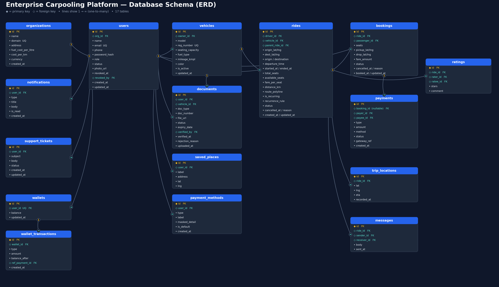

# Shifted

**Enterprise carpooling for organisations** — employees share daily rides, split fares, and stay inside a company-scoped network.

Stack: **FastAPI** + **React (Vite / TypeScript / Tailwind)** · Product brand **Shifted** · Suite label **CARPOOL/OS**

---

## Features

- Org-scoped signup, JWT auth, admin employee approval
- Find / offer rides with maps, commute presets, matching
- Instant seat booking, trip lifecycle (start → en route → complete)
- Wallet, cash (driver confirms), and Razorpay (UPI / card) payments
- Live trip chat (WebSocket), passenger → driver ratings
- Document KYC (licence / RC / insurance) with admin verify
- Admin console, support tickets, CSV + PDF fleet reports

---

## Database schema

Entity-relationship diagram for the platform data model:



---

## Repository layout

```
Shifted/
├── backend/          # FastAPI API (Python 3.11+)
├── frontend/         # React SPA (Vite)
├── carpool_schema_erd.png
├── ARCHITECTURE.md
├── DEPLOY.md
└── README.md
```

---

## Quick start

### Backend

```powershell
cd backend
py -3.13 -m venv .venv
.\.venv\Scripts\Activate.ps1
pip install -r requirements.txt
copy .env.example .env
# Set JWT_SECRET in .env (required)
python -m app.seed
python -m app.seed_extra   # optional extra demo users / rides
uvicorn app.main:app --reload --port 8000
```

- API: `http://127.0.0.1:8000/api`
- Swagger: `http://127.0.0.1:8000/docs`
- Health: `GET /api/health`

### Frontend

```powershell
cd frontend
npm install
copy .env.example .env
# Set VITE_API_BASE_URL=http://127.0.0.1:8000/api
# Set VITE_GOOGLE_MAPS_API_KEY if using maps
npm run dev
```

App: `http://localhost:5173`

---

## Demo logins

After seeding:

| Role | Email | Password |
|------|-------|----------|
| Admin | `admin@acme.com` | `Admin@123` |
| Employee (driver-ready) | `ravi@acme.com` | `Employee@123` |
| Employee | `priya@acme.com` | `Employee@123` |
| Employee | `arjun@acme.com` | `Employee@123` |
| Employee | `neha@acme.com` | `Employee@123` |
| Employee | `meera@acme.com` | `Employee@123` |
| Employee | `sanjay@acme.com` | `Employee@123` |
| Employee | `divya@acme.com` | `Employee@123` |

Org domain for signup: `acme.com`. Do **not** use these passwords in production.

---

## Environment

See `backend/.env.example`, `frontend/.env.example`, and [DEPLOY.md](./DEPLOY.md).

| Variable | Service | Purpose |
|----------|---------|---------|
| `JWT_SECRET` | Backend | Required signing secret |
| `DATABASE_URL` | Backend | SQLite default; Postgres for prod |
| `CORS_ORIGINS` / `FRONTEND_URL` | Backend | Frontend origins + email links |
| `RAZORPAY_KEY_ID` / `RAZORPAY_KEY_SECRET` | Backend | Live Razorpay checkout |
| `VITE_API_BASE_URL` | Frontend | API base ending in `/api` |
| `VITE_GOOGLE_MAPS_API_KEY` | Frontend | Maps, places, routing |

---

## Docs

- [ARCHITECTURE.md](./ARCHITECTURE.md) — system design notes
- [DEPLOY.md](./DEPLOY.md) — production checklist
- [backend/README.md](./backend/README.md) — API-focused setup

---

## License

Hackathon / internal demo project. Add a license file before public redistribution.
